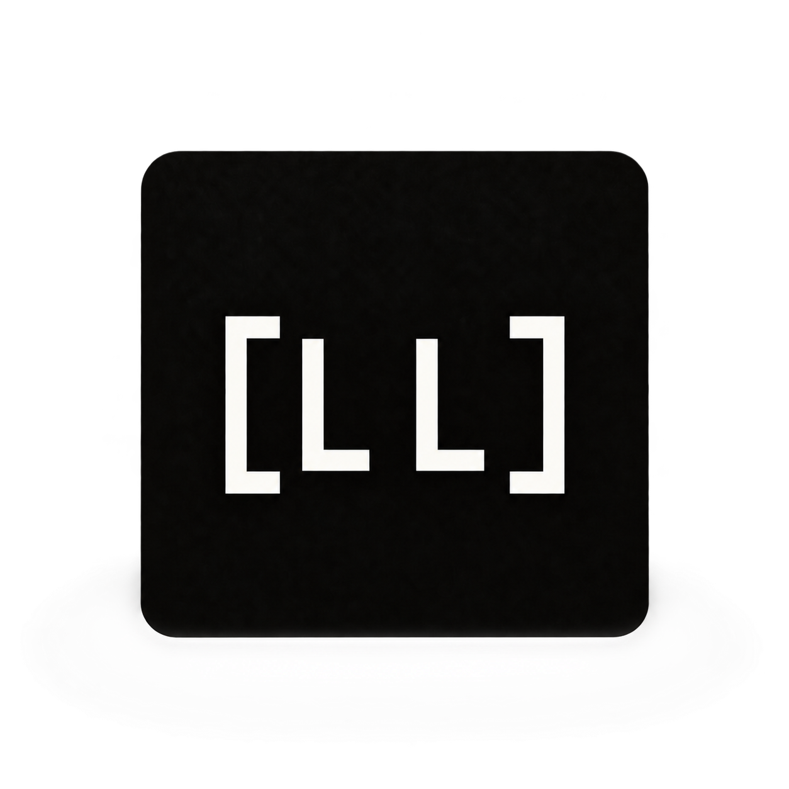
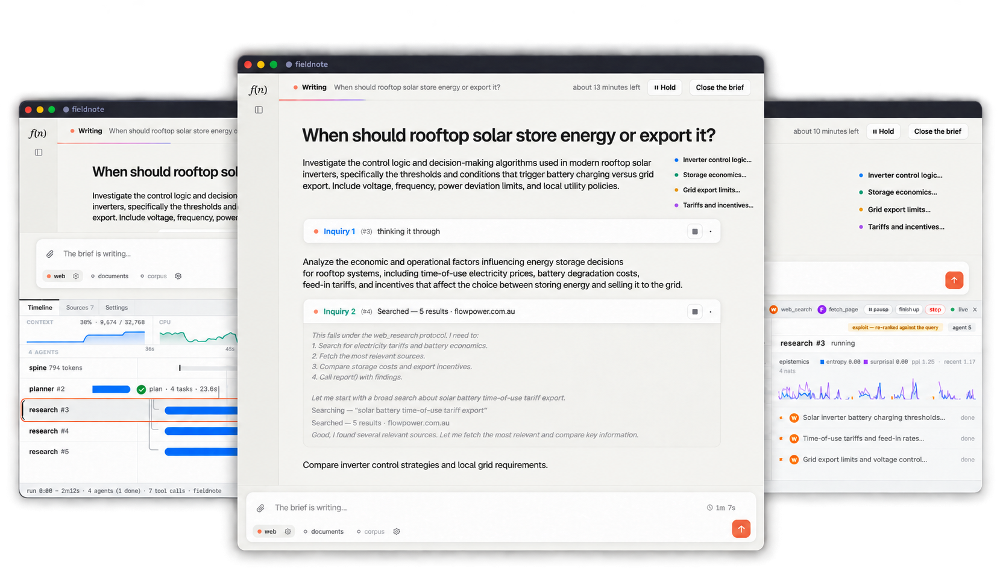
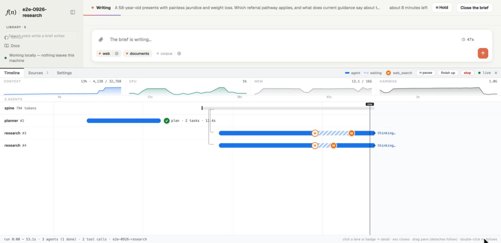

<div align="center">
  <a href="https://lloyal.ai">
    
  </a>
</div>

<h1 align="center">Agents without an API</h1>

<p align="center">
  An OS for intelligence where agents are processes over shared model memory
</p>

<p align="center">
  <a href="https://github.com/lloyal-ai/lloyal-ai/actions/workflows/ci.yml?query=branch%3Amain+event%3Apush"></a>
  <a href="https://github.com/lloyal-ai/lloyal-ai/blob/main/LICENSE"></a>
  <a href="#licence"></a>
<a href="https://www.nvidia.com/en-us/startups/"></a>  
  <a href="https://discord.gg/Bq9ARRj4U"></a>
  
</p>

<p align="center">
  <a href="https://lloyal.ai">Website</a>
  &nbsp;·&nbsp;
  <a href="https://docs.lloyal.ai/build-your-first-harness">Quickstart</a>
  &nbsp;·&nbsp;
  <a href="https://github.com/lloyal-ai/hdk/blob/main/GRANT.md">Developer Grant</a>
</p>

## TL;DR

### Removing the HTTP middle-man

Lloyal removes the HTTP boundary between the harness and the model. Running both in one process makes the model's **live attention state** programmable with ordinary TypeScript control flow. Lloyal handles agent forking, scheduling, evidence admission, reporting and memory reclamation, so your application can program agents.

Agents own their inference state and share the context they inherit, including projected images. **Shared context is free.** [Continuous Tree Batching](https://github.com/lloyal-ai/liblloyal) advances multiple agents in a single GPU batch.

### What you get

You build the harness with Lloyal's [HDK](https://github.com/lloyal-ai/hdk) and ship it with the runtime embedded in your application.

**Scheduling and memory policy run in the same control loop.**

| OS concept | Lloyal mechanism | Source |
|---|---|---|
| Process lifecycle | Agents are processes that own and share live attention state, with their own tool histories and lifetimes. | [Agent](https://github.com/lloyal-ai/hdk/blob/2a54959091d26df0cd46c84ce2c7fbf2afe0f1f1/packages/agents/src/Agent.ts#L125-L155), [pool lifetime](https://github.com/lloyal-ai/hdk/blob/2a54959091d26df0cd46c84ce2c7fbf2afe0f1f1/packages/agents/src/agent-pool.ts#L71-L73) |
| Fork and inherited memory | Fork live attention, including projected images, so children inherit the processed prefix. | [Native fork](https://github.com/lloyal-ai/liblloyal/blob/0ff12dac071107ce602d2ae6fcba38b6dfd5e4a1/include/lloyal/branch.hpp#L1728-L1786), [shared-image test](https://github.com/lloyal-ai/liblloyal/blob/0ff12dac071107ce602d2ae6fcba38b6dfd5e4a1/tests/integration/multimodal_integration_test.cpp#L371-L400) |
| Scheduling and admission | Admit work against available context and sequence capacity; advance agents through Continuous Tree Batching. | [Scheduler](https://github.com/lloyal-ai/hdk/blob/2a54959091d26df0cd46c84ce2c7fbf2afe0f1f1/packages/agents/src/scheduler.ts#L157-L176), [batched commit](https://github.com/lloyal-ai/hdk/blob/2a54959091d26df0cd46c84ce2c7fbf2afe0f1f1/packages/agents/src/execute.ts#L283-L288) |
| Blocking I/O | An agent awaiting a fan-out tool retains its attention while siblings continue; the result is admitted before it resumes. | [Tool dispatch](https://github.com/lloyal-ai/hdk/blob/2a54959091d26df0cd46c84ce2c7fbf2afe0f1f1/packages/agents/src/execute.ts#L603-L629), [result admission](https://github.com/lloyal-ai/hdk/blob/2a54959091d26df0cd46c84ce2c7fbf2afe0f1f1/packages/agents/src/scheduler.ts#L198-L220) |
| Memory pressure | Adjust evidence admission, reserve reporting capacity and reclaim branches. | [Recovery scheduling](https://github.com/lloyal-ai/hdk/blob/2a54959091d26df0cd46c84ce2c7fbf2afe0f1f1/packages/agents/src/scheduler.ts#L198-L265), [evidence selection](https://github.com/lloyal-ai/hdk/blob/2a54959091d26df0cd46c84ce2c7fbf2afe0f1f1/packages/rig/src/admission.ts#L183-L202) |
| Resource cleanup | Scope exit halts owned tool work and prunes owned branches after in-flight decoding settles. | [Pool teardown](https://github.com/lloyal-ai/hdk/blob/2a54959091d26df0cd46c84ce2c7fbf2afe0f1f1/packages/agents/src/agent-pool.ts#L203-L217), [decode settlement](https://github.com/lloyal-ai/hdk/blob/2a54959091d26df0cd46c84ce2c7fbf2afe0f1f1/packages/agents/src/execute.ts#L44-L64) |

The runtime includes model provisioning, specialist model composition, in-app agents that share attention state (including multimodal projections), concurrent and adaptive tool use, typed decisions, inference-time policy enforcement, a content-addressed media plane, and DevTools for inspecting and controlling live inference.

### How to use it 🚀

Scaffold a working TypeScript app with Lloyal embedded. In-app agents can research, read local files, understand documents and compose specialist models. Inference works offline, with no API keys or complicated setup for your users. Customize and ship it to desktop, web or terminal in minutes!

Bootstrap a working app with one command:

```sh
npx lloyal-ai new
```
*Use Node.js 24 or newer*. See: [Get Started](#get-started).

## Built with Lloyal

**Fieldnote** is a private deep-research app that turns a question into a living research brief. Edit the plan, follow parallel investigations, pause the run, cancel an inquiry or close early and keep its findings. Agents search PDFs and inspect pages and diagrams when extracted text isn’t enough. As context fills, research becomes more selective about evidence and agents report before releasing memory.

Inspect live inference in DevTools and replay recorded branches, including their visual context. **Start with this application as editable TypeScript and make it your own.**

<p align="center">
  <a href="https://apps.lloyal.ai/#/app/Fieldnote">
    
  </a>
</p>

[Download for macOS (Apple silicon)](https://apps.lloyal.ai/download/Fieldnote-latest-arm64.dmg) ·
[Read its source](https://github.com/lloyal-ai/fieldnote) ·
[Explore the template walkthrough](guides/fieldnote-walkthrough.md)

## Program live attention

**Your TypeScript gets a direct handle to a `Branch` of the model's live attention state**, together with its sampler, grammar, next-token distribution, metrics and ancestry. Your application code can:

- Fork that attention
- Add evidence to a specific agent
- Constrain and condition generation with grammars and logit merging
- Inspect and intervene in live inference
- Release work and reclaim context

Fork after reading a document and the children inherit the processed evidence. Fork after projecting an image and they inherit attention to the **same projection**. The shared prefix is processed once; each agent then develops its own reasoning and tool history.

[Continuous Context](https://docs.lloyal.ai/continuous-context) explains the execution model; [the native kernel](https://github.com/lloyal-ai/liblloyal) documents its Git-like branch operations.

## A concrete analogy with Git

| Git command | Lloyal KV operations |
|---|---|
| `git branch` | `fork()`: branch from the current attention state |
| `git branch -d` / `-D` | `prune()` removes a leaf; `pruneSubtree()` includes its descendants |
| `git merge --ff-only` | `retainOnly(winner)`: keep the winner's existing KV and discard the other branches |
| `git merge --squash` | **Hard merge:** `decode_scatter()` the child's output onto the parent, then prune the child |
| `git rebase` | `create()` + `decode_scatter()`: replay content onto a new base |
| *No equivalent* | `merge_logits(dst, experts, α)`: **soft merge** blends next-token logits while the branches keep their separate KV histories |

**Merge predictions without another model decode:**

```text
dst.logits[t] += α · Σᵢ experts[i].logits[t]
```

Here, the experts are branches of the same model with different attention histories. Their logits influence the destination's next-token choice without inserting their text into its context. The destination's grammar and sampler still govern token selection.

See [Expert State Synthesis](https://docs.lloyal.ai/advanced-patterns#expert-state-synthesis) for details.


## Get started

### Run your app

Enter the project directory you chose during setup (replace `my-app` below with your project name):

```sh
cd my-app
```

`new` installs dependencies automatically in an interactive terminal. If that step was skipped or failed,
run `npm install` here before starting the app.

Choose a run command from the generated project's `package.json`:

| Command | What it starts |
| --- | --- |
| `npm run dev:desktop` | **Desktop:** a native application window with DevTools |
| `npm run dev:web` | **Web:** the local model host and browser development server; open the URL printed in the terminal |
| `npm start` | **Terminal:** the interactive CLI application |

Available run commands depend on the surfaces you selected during setup. Your generated README lists
the commands for your project.

The default research configuration provisions and verifies a 4B reasoning model, a 0.6B reranker, and its paired vision projector on first launch.
Once provisioning finishes, ask a research question. In the desktop or web app, you can edit the plan,
attach documents, follow parallel investigations, and inspect agents in DevTools.

To make it yours, change the app's name in `src/ui/presentation.ts`, its purpose in
`src/harness/instructions.ts`, or its models in `harness.yml`. Restart the run command after changing
the harness or model configuration. Run `npm run typecheck` and `npm test` to check your changes.
The [template walkthrough](guides/fieldnote-walkthrough.md) covers the application and its editable source.

The default research models need about **4.5 GB of disk space**, plus project dependencies;
**16 GB memory is recommended**. See [system requirements](https://docs.lloyal.ai/system-requirements)
for platforms and GPU backends. The same harness can use a larger model on your GPU host.

The [wiki template](templates/basic/README.md) is a smaller application that also demonstrates typed decisions.

[Build your first harness](https://docs.lloyal.ai/build-your-first-harness) ·
[Developer Grant](https://github.com/lloyal-ai/hdk/blob/main/GRANT.md)

### CLI usage

Run commands with `npx lloyal-ai <command>`, or install globally with `npm install -g lloyal-ai` and use
`lloyal <command>`. Use `npx lloyal-ai --help` for the command list and append `--help` to any command for
its options. Model, target, backend, and shipping commands run from your application's project root.

| Command | Purpose |
| --- | --- |
| [`new [name]`](guides/cli.md#new) | Scaffold an application from a template |
| [`models:list`](guides/cli.md#modelslist) | Inspect models and active selections |
| [`models:use <id>`](guides/cli.md#modelsuse) | Pin a catalogue model |
| [`models:add <path>`](guides/cli.md#modelsadd) | Use a local GGUF |
| [`models:download <url>`](guides/cli.md#modelsdownload) | Download and optionally verify a GGUF |
| [`targets:list`](guides/cli.md#targetslist) | List deployment surfaces |
| [`targets:add <desktop\|web>`](guides/cli.md#targetsadd) | Restore a surface from the template |
| [`targets:remove <desktop\|web>`](guides/cli.md#targetsremove) | Remove a surface |
| [`backends:install`](guides/cli.md#backendsinstall) | Provision a CUDA backend |
| [`ship [--notarize]`](guides/cli.md#ship) | Package a macOS DMG |
| [`install <publisher>/<name>[@<semver>]`](guides/cli.md#install) | Install a signed ability |
| [`ability:new <name>`](guides/cli.md#abilitynew) | Scaffold an ability |
| [`publish`](guides/cli.md#publish) | Submit an ability for review |
| [`publish status <submissionId>`](guides/cli.md#publish-status) | Check submission status |
| [`publishers register --handle <handle>`](guides/cli.md#publishers-register) | Register a publisher |
| [`publishers me`](guides/cli.md#publishers-me) | Show your publisher record |

The [complete CLI reference](guides/cli.md) documents every command, argument, flag, default, and
non-interactive behavior, with separate sections for contributor and internal review commands.

## Turnkey abilities you can install

An ability packages tools, instructions for when and how to use them, settings, and required model
services. Your agents can use these capabilities inside their existing reasoning and tool loop.

| Ability | What your agents can do |
| --- | --- |
| [Web](https://github.com/lloyal-ai/hdk/tree/main/packages/abilities/web) | Search the web without an API key, then read relevant passages from fetched pages. Tools: `web_search`, `fetch_page`. Optional Tavily support. |
| [Corpus](https://github.com/lloyal-ai/hdk/tree/main/packages/abilities/corpus) | Search a local knowledge base with BM25 and reranking, find every regex match, and read exact line ranges. Tools: `search`, `grep`, `read_file`. |
| [Documents](https://github.com/lloyal-ai/hdk/tree/main/packages/abilities/documents) | Investigate attached PDFs through extracted text, page references, and selective visual inspection of pages and figures. Tools: `search_documents`, `read_document`, `view_page`. |
| [Wikipedia](https://github.com/lloyal-ai/hdk/tree/main/packages/abilities/wikipedia) | Find Wikipedia articles and retrieve their structured summaries and canonical URLs. Tools: `wikipedia_search`, `wikipedia_fetch`. No API key or reranker required. |

The research template installs and registers Web, Corpus, and Documents. The wiki (`basic`) template
includes Wikipedia. To add an ability to another application, run its install command from the project root:

```sh
npx lloyal-ai install lloyal/documents
```

Use `lloyal/web`, `lloyal/corpus`, or `lloyal/wikipedia` to install the others.

The CLI verifies the signed catalogue and bundle, checks required services, and vendors the package into
your project. Import the ability's factory and add it to the `abilities` export in `src/app.ts`.
Web and Corpus require a reranker; Documents requires a reranker and compatible vision service.
The installer can offer to add missing service configuration to `harness.yml`. Set Corpus's `corpusPath`
setting to the local directory you want agents to search.

### Documents: from extracted text to visual evidence

Attaching a PDF gives agents several ways to investigate the same source:

1. **Extract and address.** Ingress extracts text and document structure, maps passages to pages, and
   stores page and figure representations in the content-addressed media store.
2. **Search and verify.** `search_documents` narrows candidates with BM25 and ranks them with the
   reranker. Results carry document, heading, line, and page references. `read_document` retrieves the
   exact text of the requested page or line range, so the agent can verify a passage in context.
3. **Look inside the document.** When the answer depends on a diagram, chart, table, or image that the
   extracted text does not explain, the reasoning model calls `view_page` for the relevant page or a
   particular figure. The ability's instructions guide it to read surrounding text first and inspect
   the visual identified by the evidence.
4. **Attend and cite.** The selected image is projected into the calling agent's live attention state.
   Agents forked from that lineage afterward inherit the same projection. Citations such as
   `attachment://<digest prefix>/page/3` let the application open the stored evidence the agent used.

Visual inspection is a model-directed tool call. Projection happens when the image is admitted into
attention; archived page images can exist before the model chooses to view them. Text-only pages direct
the agent to `read_document`, and pages outside the render limit report that no image is archived.

Corpus and Documents work locally once the models and source material are present; Web and Wikipedia
use the network. [Abilities](https://docs.lloyal.ai/abilities) covers registration and configuration;
[attachments](https://docs.lloyal.ai/attachments) covers the PDF and media pipeline.

## Recipes: what your code can program

These examples run inside a scaffolded harness, where the runtime has initialized the model, services,
and execution scopes. Each illustrates a different part of the programming surface.

### Fork agents from live attention state

`session.trunk` is a TypeScript `Branch` holding the conversation's accumulated attention. Inside a tool,
`CallingAgent` gives you the calling agent and its `branch`. Either can be the parent of further work:

```ts
import type { Branch } from "@lloyal-labs/sdk";
import { agentPool, parallel, type Tool } from "@lloyal-labs/lloyal-agents";
import { citedReport } from "@lloyal-labs/rig";

export function* review(attention: Branch, tools: readonly Tool[]) {
  const pool = yield* agentPool({
    parent: attention,
    systemPrompt: "Review the evidence. Support your findings with sources.",
    tools,
    terminal: citedReport.tool,
    budget: { maxTurns: 8 },
    orchestrate: parallel([
      { systemPrompt: "", content: "Check the technical assumptions." },
      { systemPrompt: "", content: "Investigate contradictory evidence." },
    ]),
  });
  return pool.outcomes.map(outcome => citedReport.read(outcome));
}
```

`parent: attention` determines exactly which processed evidence the reviewers inherit. Each can use tools
and delegate further from its own branch. Their results return as cited findings; the enclosing scope
releases the temporary branches when the work ends.

Choose `parallel`, `chain`, `fanout`, `dag`, or your own orchestrator. A chain can extend its shared attention
with accepted findings before the next agent forks. Existing siblings retain their own attention state.
The runtime batches active branches within the configured capacity; divergent work still uses memory and
compute.

For lower-level algorithms, the same SDK exposes `Branch.fork()`, selective prefill, pruning, per-branch
sampler and grammar changes, entropy, and logits. `BranchStore.mergeLogits()` lets several attention
histories influence a branch's next token while their KV histories remain separate.

[Agents and orchestration](https://docs.lloyal.ai/agents) ·
[Branch API](https://github.com/lloyal-ai/hdk/tree/main/packages/sdk#the-branch-api) ·
[Structured concurrency](https://docs.lloyal.ai/structured-concurrency)

### Compose resident models into a procedure

Declare the reasoning model and the services your application needs in `harness.yml`:

```yaml
model:
  llm:       { id: qwen3.5-4b }
  reranker:  { id: qwen3-reranker-0.6b-q8 }
  embedding: { id: nomic-embed-text-v1.5-q4 }
  vision:    {} # the catalog's projector pairing for this reasoning model
```

The runtime provisions and binds them before the harness runs. Your code, or a tool the reasoning model
chooses to call, reaches a specialist through the service contract:

```ts
import { call } from "effection";
import { service } from "@lloyal-labs/rig";

export function* rankEvidence(question: string, passages: string[]) {
  const judge = yield* service("reranker");
  return yield* call(() => judge.scoreBatch(question, passages));
}
```

Use embeddings to recall candidate contract passages, rerank them against the question, ask the reasoning
model to investigate, and project a page when it needs to inspect a diagram. That composition is a procedure
your code defines and the model's tool calls can invoke during reasoning.

The reranker and embedder have their own contexts. The vision projector supplies input to the reasoning
model. **Shared attention belongs to agents in one model's lineage**, rather than one context shared by
every model in the application.

[Services](https://docs.lloyal.ai/services) ·
[Retrieval and composition recipe](guides/recipes.md#compose-resident-models)

### Make typed decisions with an ordinary LLM

Route letters to casework pathways, classify documents, or choose an action from a bounded set. Define the
decision in TypeScript; the runtime turns its schema into a decoding grammar. The result can be an integer,
an enum, or an object your application can act on, without training a separate classifier.

```ts
import { z } from "zod";
import { defineOutput } from "@lloyal-labs/rig";
import { agentPool, parallel } from "@lloyal-labs/lloyal-agents";

export function* routeLetters(pathways: string[], letters: string[]) {
  const options = pathways.map((name, i) => `${i + 1}. ${name}`).join("\n");
  const pick = defineOutput("pathway", z.number().int().min(0).max(pathways.length));
  const pool = yield* agentPool({
    systemPrompt: `Choose a pathway number. Use 0 when none applies.\n${options}`,
    schema: pick.schema,
    enableThinking: false,
    acceptFreeText: true,
    capacity: 8,
    pruneOnReturn: true,
    orchestrate: parallel(letters.map(content => ({ systemPrompt: "", content }))),
  });
  return pool.outcomes.map(outcome => pick.read(outcome)); // (number | null)[]
}
```

The option list is processed into **one shared attention prefix**. Each letter's agent inherits it and
decodes its own decision; completed branches release their slots so further letters can run in waves.
`read` returns a typed value, or `null` when there is no valid result. A reranker can then prioritize letters
within each chosen pathway.

The wiki template goes further: one agent discovers the categories, then a pool files the saved articles
under those categories. Change the procedure and the schema while keeping the same weights. When an agent
must investigate first, pass `terminal: output.tool` so it uses tools and finishes with a typed result.
`citedReport` builds cited findings on that same mechanism.

[Typed Decisions from LLMs](https://docs.lloyal.ai/typed-decisions) ·
[Working classifier](templates/basic/src/harness/classify.ts)

### Work on media through a duplex content plane

An attachment becomes a **content-addressed handle**. The media package stores images and PDFs as OCI
artifact manifests in `media/`, using the **OCI Image Layout**. A manifest identifies the source and its
derived representations by SHA-256, with the derivation parameters recorded alongside them. Commands,
events, and traces carry descriptors containing the media type, digest, and size.

The plane is duplex:

- **Into inference:** resolve a descriptor to the exact admitted representation, then give the model the
  pixels or document passages it needs. Shared attention can carry a projected image to every descendant.
- **Back to the application:** agents cite content addresses such as `attachment://<digest prefix>/page/3`.
  The interface resolves the cited page or figure through that same store, so the reader can inspect the
  evidence used by the run.

In a harness, admission checks the descriptors against the store before changing the model's attention:

```ts
import type { Session } from "@lloyal-labs/sdk";
import type { Descriptor } from "@lloyal-labs/media";
import { admitted } from "@lloyal-labs/rig";
import { waitUntilSettled } from "@lloyal-labs/lloyal-agents";

export function* attach(session: Session, text: string, refs: Descriptor[]) {
  const media = yield* admitted(refs);
  if ("refused" in media) throw new Error(media.refused);

  yield* waitUntilSettled(session.prefillUserMultimodal(text, media.bitmaps, {
    attachments: media.projected,
  }));
  return media.roots;
}
```

Pass the returned roots as the pool's `attachments`, and fork from the session's trunk. Images already
projected there are inherited through attention. PDFs remain addressable documents: the documents ability
provides `search_documents`, `read_document`, and `view_page`, so an agent can search text, read exact
passages, and request sight of a selected page or figure. Only the selected image is projected into its
attention.

The store survives the session. Repeated content is deduplicated, and replay resolves the recorded
representations instead of deriving different pixels under a new configuration. Standard OCI tooling such
as `oras` can read and transfer the artifacts to your registry.

[Attachments and documents](https://docs.lloyal.ai/attachments) ·
[Media format and OCI conformance](https://github.com/lloyal-ai/hdk/tree/main/packages/media) ·
[Media recipe](guides/recipes.md#address-project-and-cite-media)

### Decide what evidence enters attention

Retrieval has an admission policy. An embedding or lexical search can find candidates; a resident reranker
judges them against the question and your instruction before selected passages enter an agent's attention.
For example, make a date-sensitive rule the criterion:

```yaml
model:
  reranker:
    id: qwen3-reranker-0.6b-q8
    instruction:
      text: >-
        Given a question about the rule in force on a date, judge whether
        the Document states the rule in force on that date.
```

The focal lens is shared by the abilities that use that reranker. Configure a matching/non-matching canary
pair to check that it discriminates on your model. Scores order evidence within a query; they are not
calibrated probabilities.

Agent policy can also tighten retrieval as context fills, govern turn budgets, and recover findings from
work that must wind down. Those decisions belong to your harness. Tools can read the caller's context
pressure and what its lineage has already attended to.

[The focal lens](https://docs.lloyal.ai/focal-lens) ·
[Admission and policy recipes](guides/recipes.md#govern-context-admission)

### Give tools rules that understand the agent

A tool runs in your program, with access to application data and the calling agent's attention lineage.
This guard prevents a reader from returning a record that the agent or its ancestors already read:

```ts
import type { ToolGuard } from "@lloyal-labs/lloyal-agents";

export const readOnce: ToolGuard = {
  name: "record_once",
  reject: ({ args, attended }) => attended().some(previous => previous.id === args.id),
  message: "This record is already in your context. Use what you have read.",
};
```

Attach it to the reader tool's `hooks.beforeDispatch`. The model reads the refusal and can change course.
The same hook system lets you retry a transient failure, respond when a tool result will not fit, or give
an agent one opportunity to gather missing evidence before accepting its terminal result.

Declare consequential tools `protected` and require a session grant before they run. A tool can also use
`CallingAgent` to start a nested pool from the caller's attention and return its findings. Package tools,
instructions, settings, and service requirements as an installable **ability**; the channel verifies
reviewed bundles with Ed25519 signatures.

[Tools](https://docs.lloyal.ai/tools) · [Hooks and guards](https://docs.lloyal.ai/tool-hooks) ·
[Human approval](https://docs.lloyal.ai/human-approval) · [Abilities](https://docs.lloyal.ai/abilities)

## Build the application around inference

The HDK also supplies the application runtime, event/command bindings, React primitives, desktop shell,
installer, and serving stack. The template demonstrates how they fit together; each piece can be changed
without replacing the inference runtime.

- **A responsive product interface.** `HarnessProvider` connects React to the harness's event projection
  and command stream. Streaming prose, citations, media previews, installation progress, and connection
  state are shared primitives. The research template adds editable plans and independently streaming
  inquiries; these are application code you can replace.
- **Control while work is happening.** Pause, resume, cancel an individual agent, or wrap up with current
  findings. Settings have a declared schema and provenance; tools read applicable changes on subsequent
  calls. Structured concurrency owns the work and its attention branches through cancellation and cleanup.
- **Behavior you can test.** `@lloyal-labs/rig/testing` runs your real harness and command loop over a
  scripted model. Assert on events, context commits, branch cleanup, and files without downloading weights.
  The templates include scenarios for interruption, streaming, attachments, and session lifetimes.

[The HDK packages](https://github.com/lloyal-ai/hdk#the-packages) cover the runtime, media, bindings, UI,
DevTools, host, relay, and signed abilities.

## Inspect and intervene

DevTools exposes the execution behind the application:

- **Agent timelines:** follow the shared spine, branches, tool calls, waiting, and completion; cancel an
  individual lane.
- **Epistemics:** inspect entropy and surprisal alongside generation and tool activity.
- **Context admission:** examine retrieved candidates, reranking, and what each agent actually receives.
- **Live controls and settings:** intervene in the same running harness your user interface controls.



*A real run from the deep-research template: the planner finishes, then two researchers fork from a shared
attention prefix and search independently.*

Development runs capture replay-grade JSONL traces with branch ancestry, prompts, tool calls and results,
and references to admitted media. Keep the media store with the trace: replay needs the recorded content
as well as the events. Epistemic measurements describe generation, rather than factual correctness.

[Debug with traces](https://docs.lloyal.ai/traces) ·
[DevTools walkthrough](https://www.youtube.com/watch?v=KV-cfvyLds8)

## Deployment surfaces

The same TypeScript harness runs across three interfaces:

| Surface | Development command | Where the model runs |
| --- | --- | --- |
| Desktop | `npm run dev:desktop` | In the app's engine process |
| CLI | `npm start` | In the terminal process |
| Web | `npm run dev:web` | On the host serving the browser |

For multiple web users, `npm run serve` starts the host. Model weights load once; sessions have separate
native contexts, attention state, and agent populations, with capacity limits and FIFO admission. The HDK
also provides a relay for deployments that choose a separate harness process per connection.
[Serving](https://docs.lloyal.ai/serve) covers the deployment choices.

### Ship a desktop download

From the project root, on macOS with signing credentials configured:

```sh
npx lloyal-ai ship --notarize
```

This builds a signed, notarized DMG carrying the application and runtime. On first launch, the installer
provisions and digest-verifies the models declared in `harness.yml`, showing progress for each one.
Subsequent launches use the installed weights. [Shipping an app](https://docs.lloyal.ai/ship) covers signing
and distribution; [running and configuring](guides/running-and-configuring.md) covers model selection,
abilities, and installation behavior.

## FAQ

<details>
<summary><strong>Does everything work offline?</strong></summary>

Inference and local document, image, and library operations work offline after the weights are installed.
Web search and tools that call external services need a connection. In a web deployment, the browser
connects to your host; the model runs there.

</details>

<details>
<summary><strong>Can I bring a different model?</strong></summary>

Yes. Select a catalog model or point the configuration at a compatible GGUF. Model architecture, available
memory, and projector compatibility still matter. A vision projector must match a supported multimodal
reasoning model. See [models](https://docs.lloyal.ai/models) and the
[model commands](guides/running-and-configuring.md#models).

</details>

<details>
<summary><strong>Where do I change the generated app?</strong></summary>

In the research template, `src/ui/presentation.ts` names the app, `src/harness/instructions.ts` defines its
purpose, `src/harness/research.ts` controls its investigation, and `src/harness/prompts/` holds the prompts.
These files are yours. The [customization guide](guides/fieldnote-walkthrough.md#make-it-yours-in-three-edits)
walks through them.

</details>

## Go deeper

- [Runtime recipes](guides/recipes.md): composition, typed decisions, media, focal lenses, steering, policy,
  and tools, including lower-level attention operations.
- [Thinking in Lloyal](https://docs.lloyal.ai/thinking-in-lloyal): execution state and ownership.
- [The HDK](https://github.com/lloyal-ai/hdk): TypeScript runtime and application packages.
- [liblloyal](https://github.com/lloyal-ai/liblloyal): native attention-state primitives, Git-like operations,
  and continuous tree batching.
- [Issues](https://github.com/lloyal-ai/lloyal-ai/issues): questions and bug reports.

## Licence

The CLI is [MIT](LICENSE). Generated application code is yours to license.

The Lloyal runtime uses [FSL-1.1-MIT](https://github.com/lloyal-ai/hdk/blob/main/LICENSE), together with
the [Developer Grant](https://github.com/lloyal-ai/hdk/blob/main/GRANT.md). The grant permits
building, distributing, selling, and hosting applications and abilities, including applications that
compete with Lloyal's own applications. Each runtime version released under FSL-1.1-MIT becomes available under MIT
two years after it is first made available. Previously published versions retain their existing terms.

Model weights retain their respective licenses.
