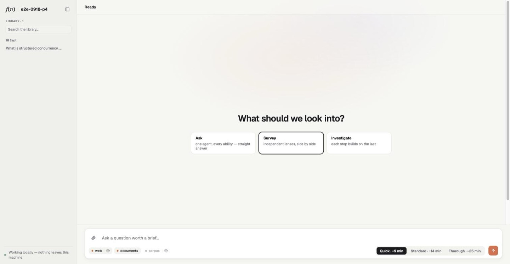
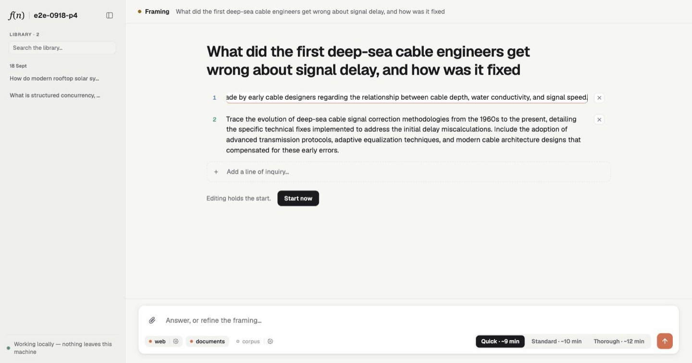
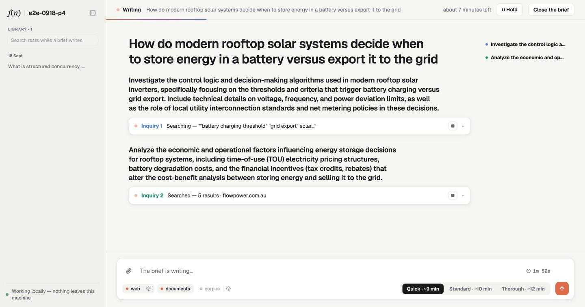
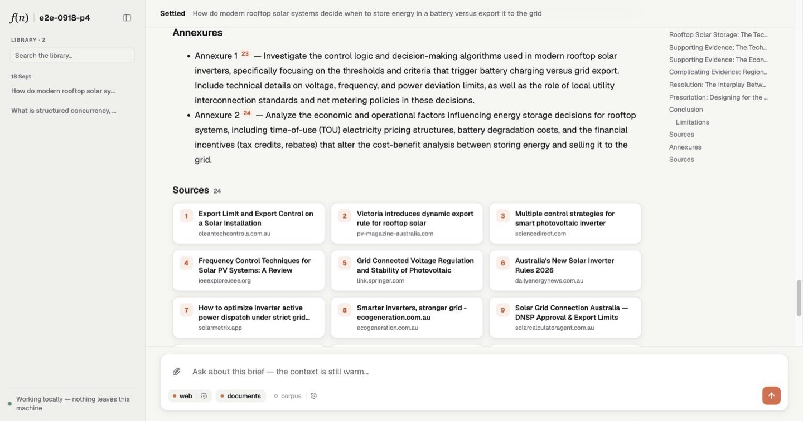

# Fieldnote template walkthrough

[Back to the README](../README.md)

## Three commands to a living brief

`new` starts you from a template. There are two, and each generated project carries its own README with its
recipes: **wiki** (`--template basic`, [its README](https://github.com/lloyal-ai/lloyal-ai/blob/main/templates/basic/README.md)),
a small Wikipedia app, and **deep-research** (`--template research`,
[its README](https://github.com/lloyal-ai/lloyal-ai/blob/main/templates/research/README.md)), a grounded
multi-agent investigation. More are coming. This guide follows the deep-research template.

```sh
npx lloyal-ai new my-app --template research
cd my-app
npm run dev:desktop
```

The first launch fetches and verifies three weights: a 4B reasoning model, a 0.6B reranker that scores what the
agents read, and a vision projector so the model can see. The app shows each step as it happens, with the bytes,
the rate and the time left, and lets you point a step at a file you already have. Every launch after that opens
at once. Then ask it something worth investigating.

Watch what appears. The outline drafts itself, line by line, from the planner's own stream. Editing a line
*is* editing the plan. Sections fill in place, each carrying its line of inquiry: searching, reading, waiting
honestly through a rate limit, writing. Click any inquiry open to watch the model think. Hold the run, drop a
line, or close the brief early and keep what it has. When it settles, the document takes the room: citation
chips, a sources grid, the deliberation on request. Ask a follow-up and it answers from a context that is still
warm.

Drop a PDF on it. The text is searched and read; a page the model needs to *look at* is projected only when it
reaches for it; and every citation points at a page you can open. Ask about a figure.

Every settled brief joins a library the next brief can search, cite and build on.

In this template the journey is four moments, and the same four words name them in its code: **Ask · Frame
· Write · Settle.**

### Ask

One question, and the shape it takes.



<br />

### Frame

The outline, held for your edits.



<br />

### Write

Inquiries searching and reading, side by side.



<br />

### Settle

The brief, its citations and its sources.



*The deep-research template, from question to settled brief.*

## Make it yours in three edits

The generated project is source, whichever template it came from. In the deep-research template, three files hold
one concern each, and one folder holds the words. Start there:

| File or folder | Responsibility |
| --- | --- |
| `src/ui/presentation.ts` | Application identity |
| `src/harness/instructions.ts` | Application purpose |
| `src/harness/research.ts` | Investigation strategy |
| `src/harness/prompts/` | Eta prompt templates |
| `src/app.ts` | Installed abilities, application parts, and event loop |
| `src/harness/brief.ts` | Brief lifecycle |
| `src/harness/` | Planning, writing, answering, and the library |
| `src/ui/` | State and presentation |

**What it is called:** `src/ui/presentation.ts`. Every surface reads it: sidebar, window, tab, terminal, host.

```ts
export const APP = { name: "Fieldnote", storage: "fieldnote" } as const;
```

**What it is for:** `src/harness/instructions.ts`. Two sentences, said on every path an answer can take.

```ts
export const INSTRUCTIONS = {
  purpose: "You help maintenance engineers investigate equipment failures.",
  answers: "Lead with the likely cause. Always name the part number.",
};
```

**How it investigates:** `src/harness/research.ts`. The strategy is one stage, `inquire`. Side by side,
one after another on a growing shared context, a fan-out, a dependency graph, or an orchestrator of your own:

```ts
// src/app.ts: hand the brief another strategy; everything else stands
const sideBySide: Research = {
  ...research,
  write: (trunk, ask, plan) =>
    research.write(trunk, ask, plan, {
      inquire: (ask, tasks, spec) => parallel(tasks.map((task, i) => spec(task, i, true))),
    }),
};
const brief = briefs({ session, library, run, wire, config: runner.config, research: sideBySide });
```

**What it says:** `src/harness/prompts/`. Every prompt the app makes is an Eta file there, rendered with
what the stage knows (`it.query`, the sources, the findings); change one and ask the next question. The
project's README says what each file is and what it is handed.

A planner, a settling pass or the whole writer can be replaced the same way: each returns a value, and the
app takes care of the rest. `npm test` runs the app's laws against a scripted model in about two seconds, so a
change is proved without downloading weights. The wiki template is the same idea at a smaller size: one
harness file, one procedure, the same three surfaces.

## What it can become

A spreadsheet that researches each row. A maintenance app that investigates competing explanations for a fault
and keeps the minority lineage alive when its evidence is material. A document app that reads, inspects the
diagrams, and keeps working through follow-ups. An analysis that admits a source only when it governs the
relevant date, so a superseded rule cannot win on relevance alone.

None of these is a mode of the framework, and none is the research template with a different name. Each is a
procedure written in TypeScript over the same primitives. The template gives you a working starting point
to change.
